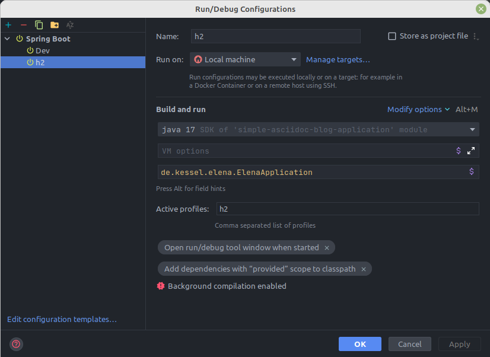
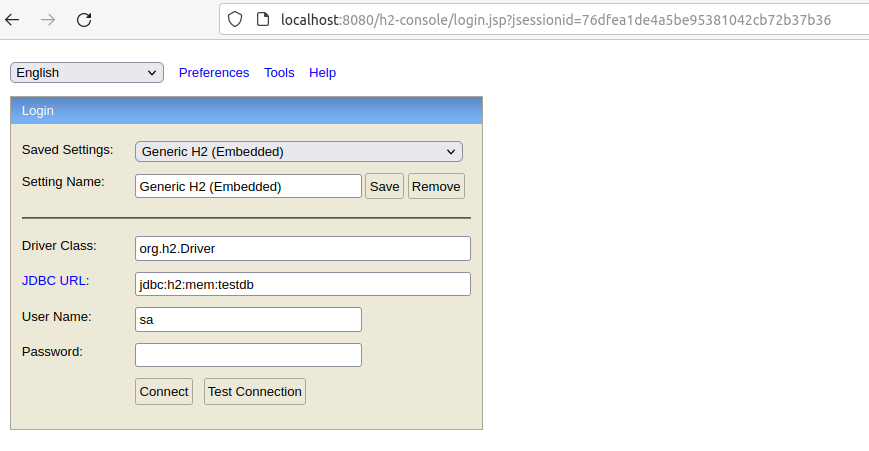
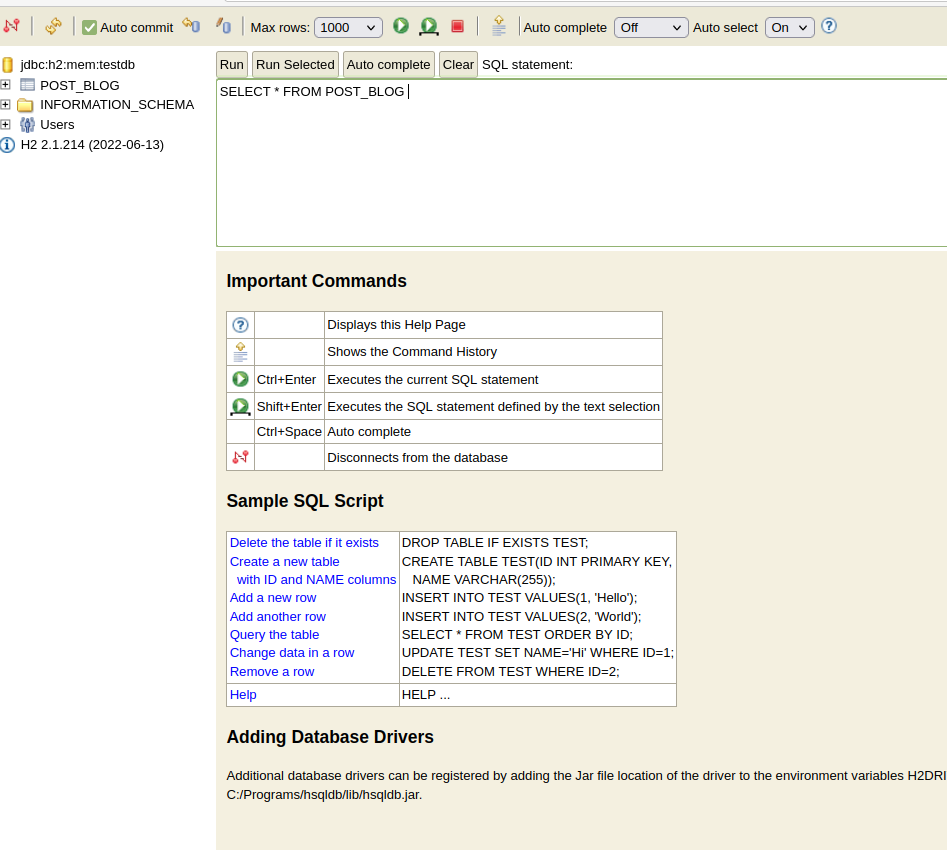

= Part 1
Martin Keßel <kesselmartin@web.de>
:description: This article describes the first implementation.
:keywords: spring boot, asciidoctorj, asciidoc, pdf, html

:toc:
:toclevels: 3
:toc-title: table of contents
:toc-placement!:
:sectanchors:
:numbered:
toc::[]

:includedir: _includes
:sourcedir: ../src/main/

== Application Skeleton

=== Create Git Repository

=== Create Project

=== Spring Dependencies

[source,xml]
----
include::../pom.xml[]
----

=== Source Code:

==== Create PostBlog Entity

[source, java]
----
include::{sourcedir}/java/de/kessel/elena/entity/PostBlog.java[]
----

==== Create PostBlog Repository

[source, java]
----
include::{sourcedir}/java/de/kessel/elena/repository/PostBlogRepository.java[]
----

==== Create PostBlog Service

[source, java]
----
include::{sourcedir}/java/de/kessel/elena/service/PostBlogService.java[]
----

==== Create Example Data

[source, java]
----
include::{sourcedir}/java/de/kessel/elena/config/DataInstaller.java[]
----

==== H2 Profile for H2

[source, properties]
----
include::{sourcedir}/resources/application-h2.properties[]
----

==== Run Application

===== Run Application over Maven

[source, shell]
----
mvn spring-boot:run
----

===== Run Application with Profile h2
]

==== Test on the h2 Database

